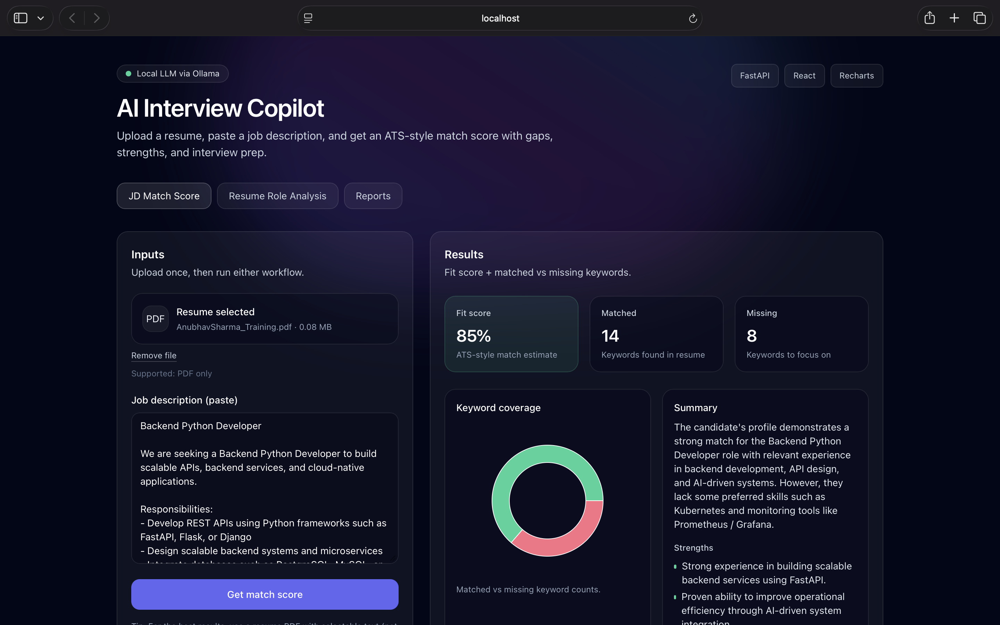
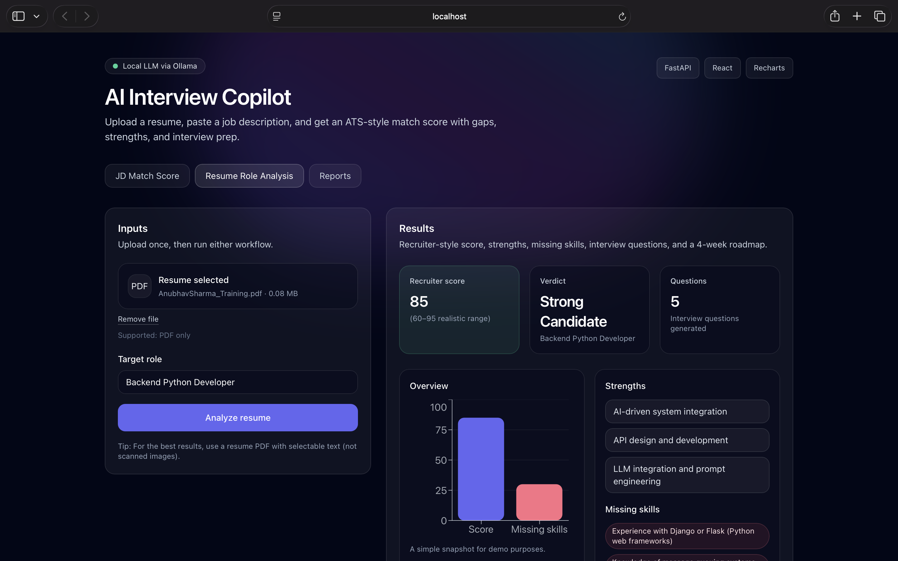
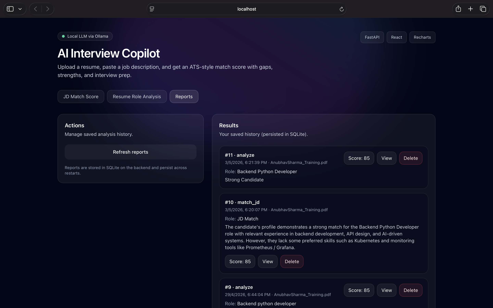

# AI Interview Copilot (Local LLM) — API + Dashboard

An end-to-end project that **analyzes resumes** and computes a **Resume ↔ Job Description match score** using a **local LLM (Ollama)**.

Built to be demo-ready for a portfolio (clean UI, charts, clear outputs, reproducible setup).

## What you can do (functionalities)

### Resume vs Job Description Match Score
- **Paste Job Description**
- **Upload Resume PDF**
- Get:
  - **Fit % (0–100)**
  - 2–3 sentence summary
  - matched keywords
  - missing keywords (gap analysis)
  - strengths and concerns
  - charts for keyword coverage

### Resume Role Analysis
- Provide a **target role** (e.g. "Backend Engineer (Python)")
- **Upload Resume PDF**
- Get:
  - recruiter-style score (realistic range)
  - verdict (Strong / Moderate / Weak Candidate)
  - strengths
  - missing skills
  - 5 interview questions
  - 4-week upskilling roadmap
  - charts for a quick visual snapshot

### Persistent Reports (History)
- Every successful analysis automatically saves a **report** in SQLite
- Dashboard includes a **Reports** tab to:
  - list all reports (newest first)
  - view full result JSON
  - delete reports

## Tech stack

- **Backend**: FastAPI
- **LLM**: Ollama (configurable model)
- **Resume parsing**: `pypdf` (text-based PDFs)
- **Frontend**: React + TypeScript (Vite)
- **UI**: TailwindCSS
- **Charts**: Recharts

## Run locally

### 1) Start Ollama

Install Ollama and run a model (example):

```bash
ollama serve
ollama pull mistral
```

### 2) Backend (FastAPI)

Create a `.env` in the repo root:

```bash
OLLAMA_URL=http://localhost:11434/api/generate
OLLAMA_MODEL=mistral
```

Install and run:

```bash
python -m venv venv
source venv/bin/activate
pip install -r requirements.txt
uvicorn app.main:app --reload
```

Backend runs at `http://localhost:8000`.

### 3) Frontend (Dashboard)

```bash
cd frontend
npm install
cp .env.example .env
npm run dev
```

Frontend runs at `http://localhost:5173` and calls the API using `VITE_API_BASE_URL`.

## API endpoints

- `POST /analyze` (multipart form)
  - `role`: string (required)
  - `file`: resume PDF (required)

- `POST /match-jd` (multipart form)
  - `jd`: string (required)
  - `file`: resume PDF (optional if `resume_text` is provided)
  - `resume_text`: string (optional)
  
- `GET /reports`
- `GET /reports/{id}`
- `DELETE /reports/{id}`

## Notes / limitations

- Best results when the resume PDF contains selectable text (not scanned images).
- All processing happens locally (LLM via Ollama), ideal for privacy-sensitive resume data.

## 📸 Screenshots

### 🏠 Homepage


### 📊 Resume Analysis Dashboard


### 📁 Reports Dashboard


### ⚙️ FastAPI Swagger Docs


---


## Author
Anubhav Sharma

